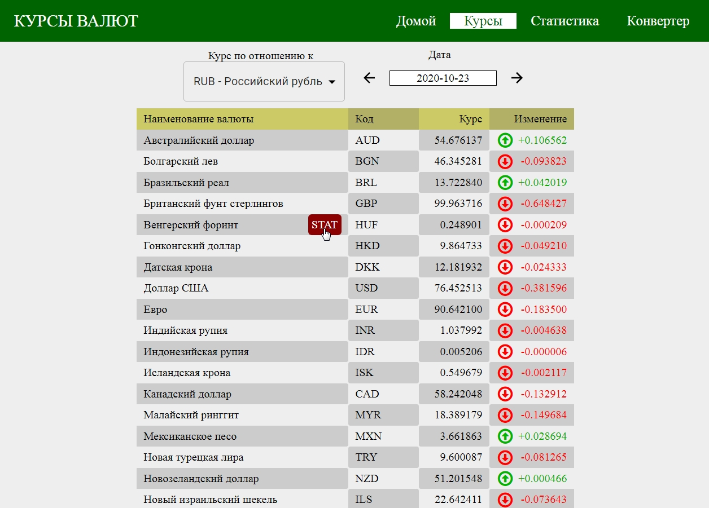
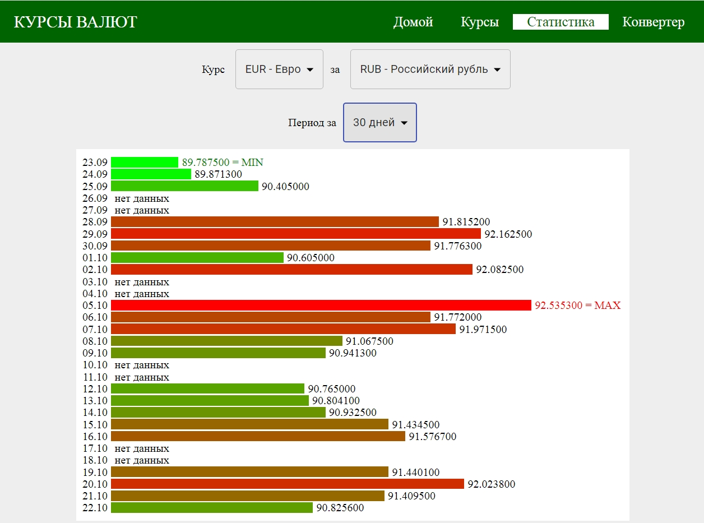
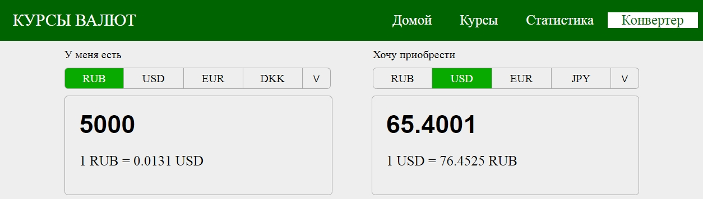
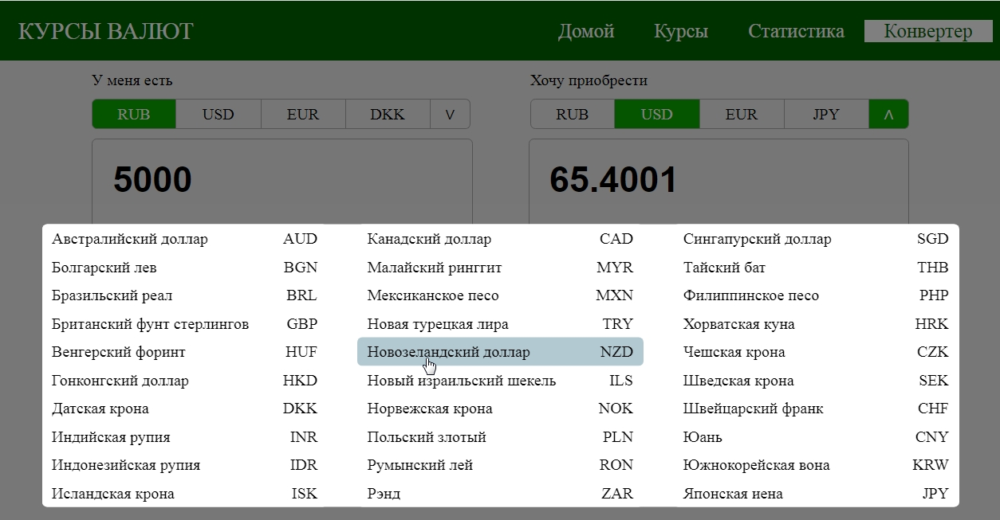

# exchange-rates
Ссылка: https://alexaltrex.github.io/exchange-rates

## Описание
Курсы валют: база данных обменных курсов, статистика изменения, калькулятор обмена

## Запуск проекта:
Для установки и запуска необходимы установленные программы: Node.js, npm, Git;
1. Клонирование и запуск: git clone https://github.com/Alexaltrex/exchange-rates.git;
2. Переход в директорию с проектом: cd exchange-rates;
3. Установка зависимостей: npm install;
4. Запуск проекта в режиме разработки: npm start;
5. Перейти в браузер и открыть страницу: http://localhost:3000.

## Цель проекта
* Знакомство с React (первое приложение на React);
* Изучение redux, react-redux.

## Разработка
* Приложение разработано на базе библиотеки React v.16.13.1 с использованием Create React App (https://github.com/facebook/create-react-app);
* Приложение разработано на базе API: 'https://api.exchangeratesapi.io';
* Глобальное состояние: управление - Redux v.4.0.5, доступ - react-redux (connect) v.7.2.1;
* Деление компонент на "глупые" функциональные и контейнерные (обертки для доступа к store или классовые для побочных эффектов); 
* Побочные эффекты: методы жизненного цикла componentDidMount и componentDidUpdate классовых компонент;
* Роутинг: React-router-dom v.5.2.0;
* Асинхронный код: Redux-thunk v.2.3.0;
* Сетевые запросы: Axios v.0.19.2.

## Структура приложения
Заголовок и основной контент.

### 1. Заголовок:
* Логотип;
* Главное меню с ссылками на страницы "Курсы", "Статистика", "Конвертер"

### Страница "Курсы"
* Верхняя панель управления с возможностью выбора валюты, относительно которой показан курс обмена и поля выбора даты.
* Таблица данных с курсом обмена для списка стран. Для каждой строки есть возможность перейти на страницу "Статистика" с соответствующей для этой пары валют статистикой.
 

### Страница "Статистика"
Статистика изменения курса валют по времени
* Верхняя панель управления с возможностью выбора пары валют и периода времени (3 дня, 7 дней, 14 дней, 30 дней);
* Графическое представление изменения курса валют по времени.

### Страница "Конвертер"
Калькулятор обмена валют

